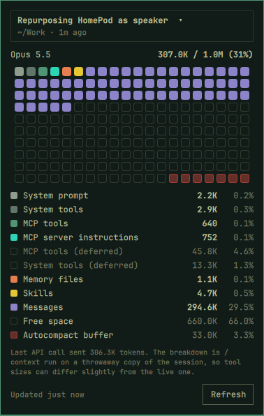

# Claude Context

An [Omarchy](https://omarchy.org/) bar widget that shows Claude Code's `/context` for your recent sessions:
how full the context window is, and what's filling it.

<p></p>

- **The grid**: 20 x 10 cells, each 0.5% of the context window, coloured by category in `/context` order,
  then free space, then the autocompact buffer (red).
- **Legend**: every category with its tokens and share of the window. Deferred tools are listed dimmed, since
  they aren't loaded.
- **Session picker**: the newest session by default; pick any of the 8 most recent (title, folder, age).
- **Refresh**: runs only when you open the panel, press **R**, click Refresh or right-click the icon. Esc
  closes it.

It sits well next to Omarchy's own Agents widget, which shows plan limits and token history.

## How it works

`bin/claude-context` runs Claude Code's own `/context` on a **throwaway fork** of the session:

```bash
claude -p --resume <session> --fork-session --no-session-persistence \
  --setting-sources user --settings '{"disableAllHooks": true}' --strict-mcp-config /context
```

That makes **no API call** (about 3 s) and the real session is never written to. The script parses the output
into JSON for the panel. It runs non-interactively, so tool sizes can differ slightly from `/context` inside
the live session. "Last API call sent N tokens" is read from the session's transcript in `~/.claude/projects`.

### What it does and doesn't run

`/context` has to run from the session's own project folder, and Claude Code's headless mode would normally
load that project's hooks and MCP servers there without asking. Opening the panel must not run anything a
repo can change after the fact, so the extra flags above turn all of that off for the inspection:

- **No project code runs.** The project's and local settings (where a repo's hooks live) and its MCP servers
  (`.mcp.json`) are not loaded, and hooks from your own user settings are skipped too.
- **The numbers can differ from the live session.** Because no MCP servers are started, the legend leaves
  out the MCP tools category, so for a session that used MCP servers the free space shown is larger than in
  the live session. Anything that came only from the project's own settings (a project-level model setting
  or project-enabled plugins, say) isn't applied either. For a session with neither, the output is the same.
- **Nothing is sent anywhere.** The plugin reads transcripts under `~/.claude/projects` locally and makes
  no network requests of its own.

## Install

```bash
omarchy plugin add https://github.com/jchisholm59/omarchy-claude-context.git --enable
```

Needs [Claude Code](https://claude.com/claude-code) and `python3` (part of a stock Omarchy install).
No sudo or pkexec is required.
The script looks for `claude` on `PATH`, then in `~/.local/bin`, `~/.claude/local` and mise's install directory,
since Omarchy's shell doesn't see a terminal's PATH.

To put it right after the Agents icon: `omarchy bar move jim.claude-context --section right`, or use
[Widget Controller](https://github.com/jchisholm59/omarchy-widget-controller).

## Remove

```bash
omarchy plugin remove jim.claude-context
```

It keeps no files of its own outside the plugin folder.

## Command line

```bash
~/.config/omarchy/plugins/jim.claude-context/bin/claude-context --list   # recent sessions, JSON
~/.config/omarchy/plugins/jim.claude-context/bin/claude-context [id]      # /context for one (default newest)
omarchy-shell jim.claude-context toggle                                   # open/close the panel
```
